# ⚖️ FinComply — Financial Compliance Intelligence Platform

<div align="center">


**A production-grade RAG (Retrieval-Augmented Generation) platform for Thai financial compliance documents.**

Query AML regulations, BOT guidelines, and SEC policies using natural language — powered by hybrid semantic search and LLM generation.

[Demo](#demo) · [Architecture](#architecture) · [Quick Start](#quick-start) · [API Reference](#api-reference)

</div>

---

## 📋 Table of Contents

- [Overview](#overview)
- [Demo](#demo)
- [Architecture](#architecture)
- [Tech Stack & Design Decisions](#tech-stack--design-decisions)
- [Features](#features)
- [Quick Start](#quick-start)
- [Configuration](#configuration)
- [API Reference](#api-reference)
- [Project Structure](#project-structure)
- [Development](#development)

---

## Overview

FinComply solves a real problem in Thai financial services: **compliance officers and analysts spend hours manually searching through dense regulatory PDFs** (AMLO Act, FATF guidelines, BOT circulars) to answer questions about AML/CTF requirements.

This platform indexes regulatory documents and enables natural language Q&A with source citations — reducing lookup time from hours to seconds.

**Key capabilities:**
- 🔍 **Hybrid search** — combines dense semantic vectors (bge-m3) with sparse lexical matching (BM25) via Qdrant RRF fusion for high-precision retrieval
- 🤖 **LLM-powered answers** — Groq LLaMA 3.3 70B generates contextual answers grounded in retrieved documents
- 📊 **Full observability** — query latency, satisfaction metrics, LLM tracing via LangFuse
- 🔐 **JWT authentication** — role-based access (admin/viewer)
- ⚡ **Redis caching** — embedding cache eliminates re-computation for repeated queries

---

## Screenshots

### 🔐 Login
> JWT authentication with glassmorphism UI

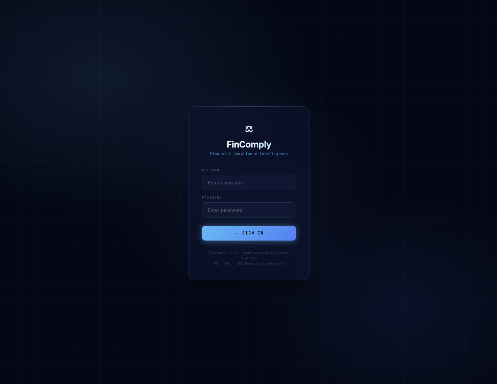

---

### ⚖️ Q&A Interface
> Natural language queries in Thai/English with source citations and relevance scores

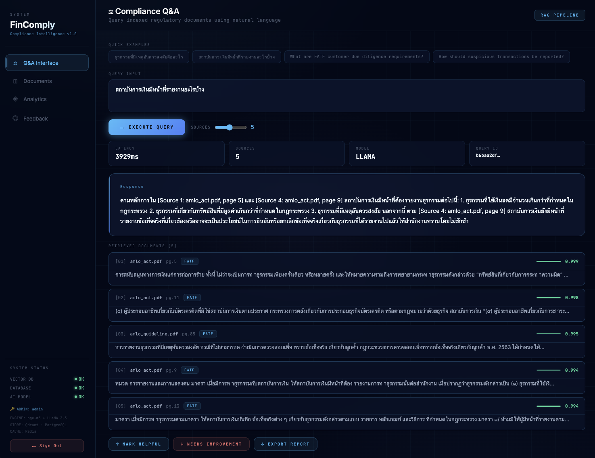

---

### 📁 Document Manager
> Drag-and-drop PDF upload, document statistics, re-indexing with progress tracking

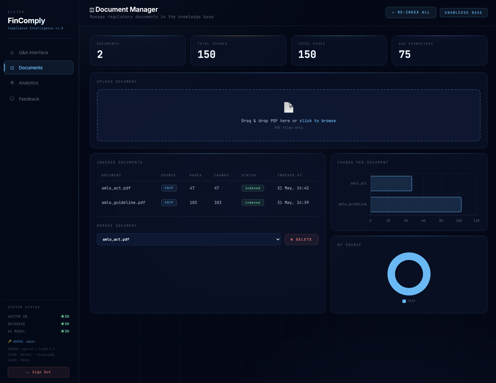

---

### 📊 Query Analytics
> Real-time metrics — query volume, latency trend, distribution, queries by hour, search history

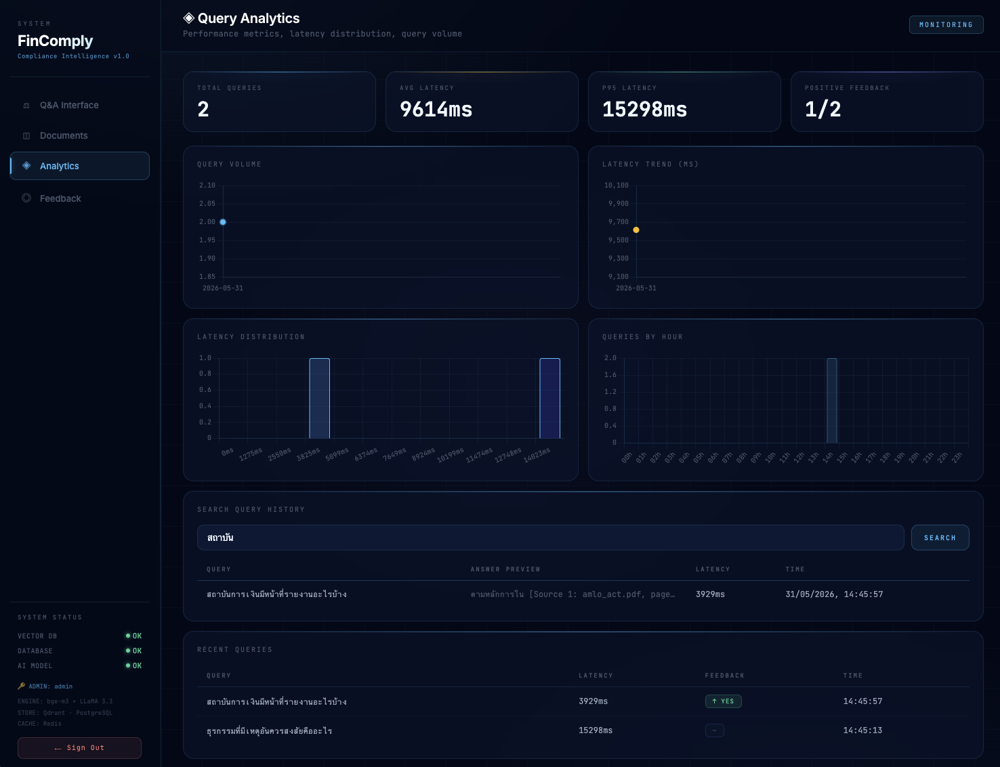

---

### 💬 Feedback Report
> Satisfaction gauge, feedback trends, flagged low-quality answers

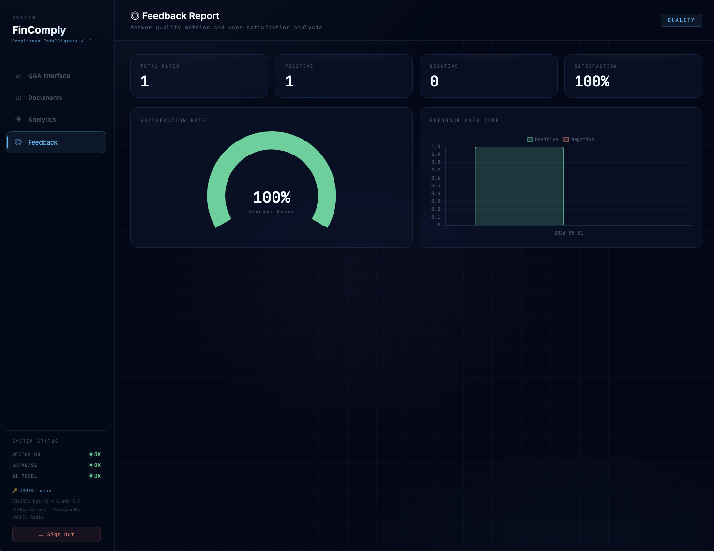

---

### ⚙️ Prefect — Pipeline Orchestration
> Gantt view of ingestion task runs — load → chunk → embed → index → log

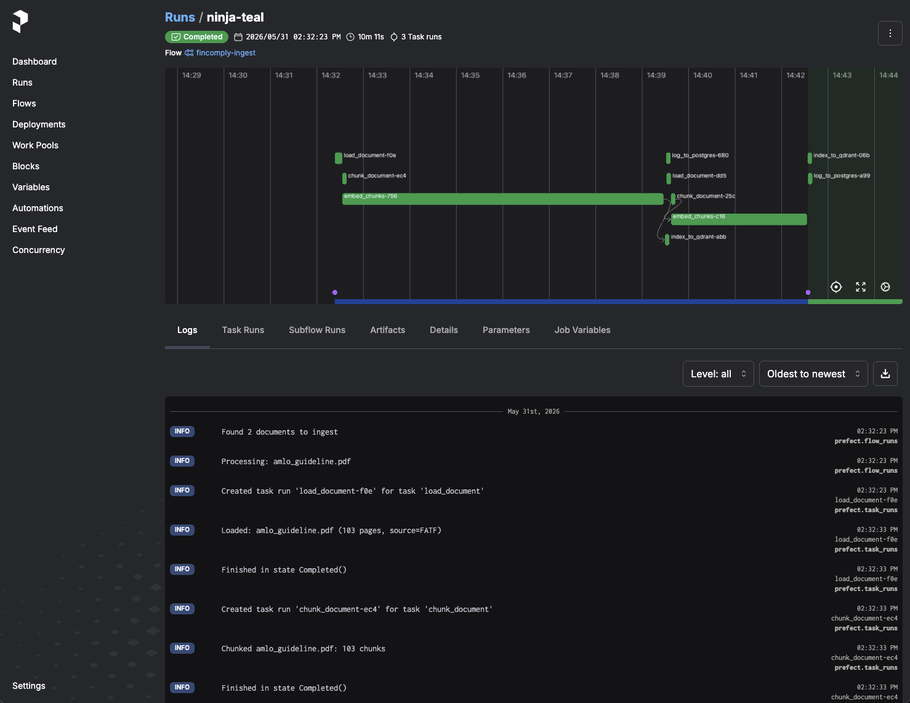

---

### 🗄️ Qdrant — Vector Database
> `fincomply_docs` collection with hybrid vectors — dense (1024-dim) + sparse (BM25)

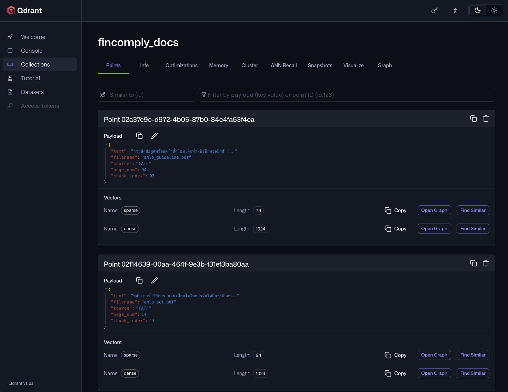

---

### 📡 FastAPI — API Documentation
> Auto-generated OpenAPI docs with JWT auth, all 12 endpoints

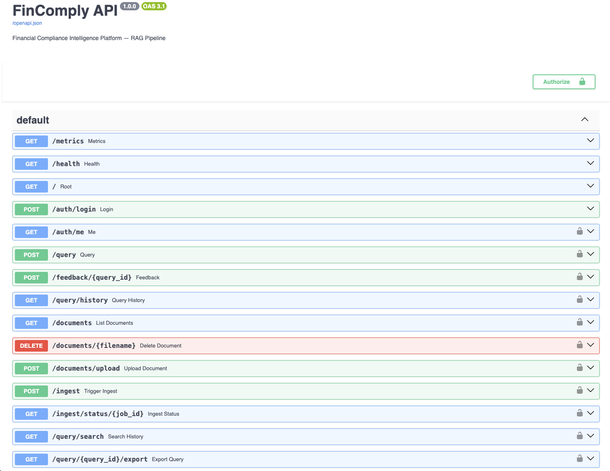

---

## Architecture

### System Overview



### Query Flow (RAG Pipeline)


### Ingestion Pipeline


### Embedding Service Architecture

The embedding service is a **dedicated microservice** — a key design decision that enables:


**Why separate service?**
1. Model loads once (~3GB RAM) — shared by API and Ingestion
2. Redis caches embeddings — identical queries skip model entirely
3. Request batching — groups concurrent requests within 20ms window for efficiency
4. Independent scaling — can scale embedding compute separately

---

## Tech Stack & Design Decisions

| Layer | Technology | Why This Choice |
|-------|-----------|-----------------|
| **Embedding** | BAAI/bge-m3 | Best multilingual open-source model; supports Thai + English; produces both dense (1024-dim) and sparse (BM25) vectors from a single model — essential for hybrid search |
| **Vector DB** | Qdrant | Built-in hybrid search with RRF fusion; no external BM25 index needed; outperforms Pinecone/Weaviate for hybrid workloads; Docker-native |
| **Reranking** | Cohere Rerank API | Cross-encoder reranking improves precision from top-20 → top-5; free tier sufficient for portfolio; production-grade quality |
| **LLM** | Groq + LLaMA 3.3 70B | Free API; 2-3x faster inference than OpenAI; strong multilingual capability; designed to support OpenAI/Claude swap via config |
| **Orchestration** | Prefect 3 | Modern Python-native; lighter than Airflow; better UX for data pipelines; built-in retry logic and scheduling |
| **API** | FastAPI | Async-native; automatic OpenAPI docs; Pydantic validation; 3x faster than Flask for I/O-bound workloads |
| **Observability** | LangFuse | RAG-specific tracing (retrieval quality, generation quality); open-source; tracks token usage and latency per step |
| **Caching** | Redis | TTL-based embedding cache; 100x speedup for repeated queries; prevents redundant GPU/CPU calls |
| **Database** | PostgreSQL | ACID compliance for audit trail; structured query logs and feedback; proper indexing for analytics queries |
| **Container** | Docker Compose | Reproducible 9-service deployment; production parity; single `make up` startup |

### Why Hybrid Search over Pure Semantic Search?

AML/compliance documents contain many **technical terms** (STR, CDD, PEP, FATF Recommendation 10) that semantic search can miss if the query phrasing differs. Hybrid search combines:

- **Dense vectors** — captures semantic meaning ("suspicious activity" ≈ "unusual transactions")
- **Sparse vectors** — captures exact terms ("STR", "กฎกระทรวง", specific article numbers)
- **RRF fusion** — combines rankings without requiring weight tuning

This is particularly important for Thai regulatory text where acronyms and legal terms must be matched exactly.

---

## Features

### 📄 Q&A Interface
- Natural language queries in Thai and English
- Source citations with page numbers and relevance scores
- Export query results as HTML report
- Thumbs up/down feedback collection
- Query history search

### 📁 Document Manager
- Drag-and-drop PDF upload
- Real-time re-indexing with progress polling
- Document statistics (chunks, pages, source)
- Delete documents from knowledge base

### 📊 Query Analytics
- Daily query volume trends
- Latency distribution (avg, P95)
- Queries by hour heatmap
- Recent query table with feedback

### 💬 Feedback Report
- Satisfaction rate gauge
- Positive/negative trends over time
- Flagged low-quality answers for review

### 🔐 Authentication
- JWT-based authentication (24h expiry)
- Role-based access: `admin` (full access) / `viewer` (read-only)
- Auto-redirect to login on token expiry

---

## Quick Start

### Prerequisites
- Docker & Docker Compose
- 8GB+ RAM (bge-m3 requires ~3GB)
- 20GB+ free disk
- Free API keys: [Groq](https://console.groq.com) · [Cohere](https://dashboard.cohere.com)

### Setup

```bash
# 1. Clone repository
git clone https://github.com/Meuracha/fincomply.git
cd fincomply

# 2. Configure environment
make setup          # copies .env.example → .env
# Edit .env with your API keys

# 3. Start all services (first run takes ~10 min to download bge-m3)
make up

# 4. Add regulatory PDFs to data/raw/
# Thai AMLO documents: https://www.amlo.go.th
# FATF guidelines: https://www.fatf-gafi.org

# 5. Index documents
make ingest

# 6. Open dashboard
open http://localhost
# Login: admin / fincomply2024 (change ADMIN_PASSWORD in .env)
```

### Service URLs

| Service | URL | Description |
|---------|-----|-------------|
| Dashboard | http://localhost | Main UI |
| API Docs | http://localhost:8010/docs | Swagger UI |
| Prefect | http://localhost:4200 | Pipeline monitoring |
| Qdrant | http://localhost:6333/dashboard | Vector DB UI |

### Make Commands

```bash
make up         # Start all services
make down       # Stop all services
make ingest     # Run ingestion pipeline
make health     # Check API health
make test       # Run test suite
make logs       # Tail all logs
make lint       # Run flake8
make format     # Run black + isort
```

---

## Configuration

Copy `.env.example` to `.env` and configure:

```env
# Required
GROQ_API_KEY=your_groq_api_key
COHERE_API_KEY=your_cohere_api_key

# Authentication
ADMIN_PASSWORD=your-secure-password
JWT_SECRET_KEY=your-secret-key-min-32-chars

# Optional
LANGFUSE_PUBLIC_KEY=...   # LLM observability
LANGFUSE_SECRET_KEY=...
VIEWER_USERNAME=viewer    # Read-only user
VIEWER_PASSWORD=...
TOKEN_EXPIRE_HOURS=24
```

---

## API Reference

### Authentication

```bash
# Login
POST /api/auth/login
{"username": "admin", "password": "..."}
→ {"access_token": "...", "role": "admin"}

# Use token in requests
Authorization: Bearer <token>
```

### Core Endpoints

```bash
# Query
POST /api/query
{"query": "ธุรกรรมที่มีเหตุอันควรสงสัยคืออะไร", "top_k": 5}

# Submit feedback
POST /api/feedback/{query_id}
{"rating": 1}   # 1=helpful, -1=not helpful

# Query history
GET /api/query/history?limit=50

# Search history
GET /api/query/search?q=suspicious+transaction

# Export report
GET /api/query/{query_id}/export
```

### Document Management (Admin only)

```bash
# List documents
GET /api/documents

# Upload PDF
POST /api/documents/upload
Content-Type: multipart/form-data
file=@document.pdf

# Delete document
DELETE /api/documents/{filename}

# Trigger re-indexing
POST /api/ingest

# Check ingestion status
GET /api/ingest/status/{job_id}
```

---

## Project Structure

```
fincomply/
├── serving/                    # FastAPI application
│   ├── main.py                 # API endpoints
│   └── auth.py                 # JWT authentication
│
├── ingestion/                  # Document processing
│   ├── config.py               # Shared configuration
│   ├── embedder.py             # HTTP client → Embedding Service
│   ├── chunker.py              # Semantic chunking (LlamaIndex)
│   ├── indexer.py              # Qdrant vector indexing
│   └── loaders/
│       ├── pdf_loader.py       # PDF parsing + Thai text cleaning
│       ├── docx_loader.py      # Word document support
│       └── web_loader.py       # URL scraping
│
├── retrieval/                  # RAG retrieval
│   ├── searcher.py             # Hybrid search (Qdrant RRF)
│   ├── reranker.py             # Cohere reranking
│   └── generator.py            # Groq LLM generation
│
├── embedding_service/          # Dedicated embedding microservice
│   └── main.py                 # FastAPI + bge-m3 + Redis cache
│
├── flows/                      # Prefect pipelines
│   ├── ingest_flow.py          # Main ingestion flow
│   └── refresh_flow.py         # Weekly re-embedding flow
│
├── monitoring/
│   └── langfuse_client.py      # LLM observability tracing
│
├── dashboard/
│   └── static/
│       ├── index.html          # Main dashboard (glassmorphism UI)
│       └── login.html          # Authentication page
│
├── docker/                     # Container configuration
│   ├── Dockerfile.api
│   ├── Dockerfile.ingestion
│   ├── Dockerfile.embedding
│   ├── Dockerfile.dashboard
│   ├── nginx.conf
│   └── init.sql
│
├── tests/
│   ├── test_api.py
│   └── test_ingestion.py
│
├── .github/workflows/
│   ├── ci.yml                  # Lint + test on PR
│   └── cd.yml                  # Deploy on main push
│
├── docker-compose.yml
├── Makefile
├── .env.example
└── README.md
```

---

## Development

### Running Tests

```bash
make test                   # All tests
make test-api               # API tests only
make test-ingestion         # Ingestion tests only
make test-cov               # With coverage report
```

### Code Quality

```bash
make lint       # flake8
make format     # black + isort
make security   # bandit security scan
```

### Adding New Document Sources

1. Place PDFs in `data/raw/`
2. Run `make ingest` or click **Re-index** in the dashboard
3. Documents are automatically chunked, embedded, and indexed

### Extending the LLM

The generator is provider-agnostic. To switch to OpenAI or Claude:

```python
# retrieval/generator.py
# Replace Groq client with OpenAI/Anthropic client
# Update model name in config
```

---

## Roadmap

- [ ] OCR pipeline for scanned PDFs (Tesseract + Thai language pack)
- [ ] Multi-user workspace support
- [ ] Scheduled document refresh (weekly FATF/BOT updates)
- [ ] Kubernetes deployment manifests
- [ ] OpenAI/Claude provider support

---

<div align="center">
Built by <a href="https://github.com/Meuracha">Uracha Rittikulsittichai</a> · 
<a href="https://github.com/Meuracha/fincomply">GitHub</a>
</div>